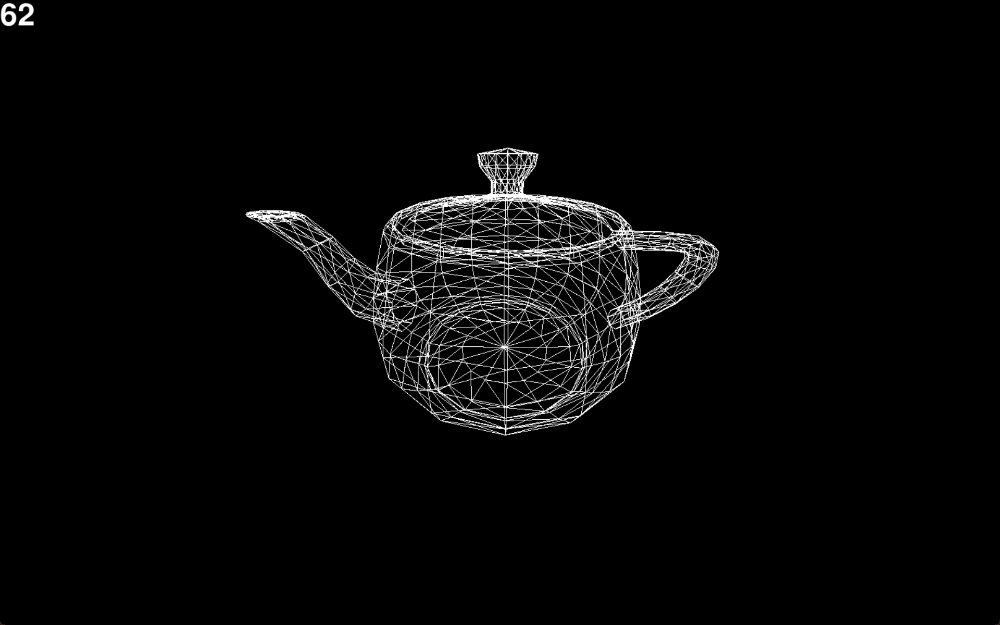

# 3D .OBJ Viewer

This is a 3D wireframe OBJ viewer built in Python using Pygame. The program parses vertex and face data from `.obj` files, converts the model into connected 3D points, and renders it using a custom camera, rotation matrices, perspective projection, and camera-plane clipping.

The 3D rendering and OBJ parsing logic are implemented manually without the use of a 3D graphics engine or OBJ parsing library.




## Features

- Loads and parses `.obj` files from objfiles folder
- Converts OBJ faces into connected wireframe geometry
- Custom 3D camera with mouse-controlled rotation
- WASD camera movement
- Perspective projection based on depth
- Custom matrix multiplication and rotation matrices
- Clips geometry that passes behind the camera
- Displays frame rate
- Supports fullscreen rendering

## Controls
- **Mouse** - Look around
- **W / A / S / D** - Move forward, left, backward, and right
- **Space** - Move upward
- **Left Shift** - Move downward
- **R** - Increase movement speed
- **Escape** - Exit Program

## Requirements

- Python 3
- Pygame

Install Pygame:
```bash
pip install pygame
```

## How to Run

- Clone or download repository
- Place `.obj` file you want to view in objfiles folder
- Edit filename = "teapot.obj" at the top of objViewer to the file name of your file.
- Run objviewer

## Implementation

### OBJ Parsing

The program reads an OBJ file line by line and extracts vertex (`v`) and face (`f`) entries.

Each vertex is converted into a `Point` object containing its 3D coordinates. Face indices are then used to connect those points together. The resulting connections represent the edges of the model and are later drawn as a wireframe.
OBJ vertex indices begin at 1, so they are converted to Python's zero-based list indexing when retrieving points.

### Camera

The camera stores both a 3D position and horizontal/vertical viewing angles.

Before rendering each frame, every point in the model is translated relative to the camera's position. This effectively treats the camera as the origin of the scene.
The translated points are then rotated based on the camera's viewing direction. Rotation matrices are generated for each axis and applied using a custom matrix multiplication implementation.

### Perspective Projection

After the points have been transformed into camera-relative coordinates, their X and Y positions are scaled based on their Z distance from the camera.

Points farther from the camera are drawn closer together, while nearby points appear larger. This creates the perspective effect required to display 3D geometry on a 2D screen.
The resulting coordinates are then converted into Pygame screen coordinates.

### Camera- Plane Clipping

A line cannot be projected normally if part of it lies behind the camera. When an edge connects a visible point to a point behind the camera, the program calculates where that edge would intersect with the camera plane (z=0). A temporary point is created at the intersection, and only the visible portion of the edge is rendered.
These temporary clipping points are removed after each frame.

### Rendering Loop

Each frame follows this process:

1. Read user input
2. Update camera rotation
3. Translate model coordinates relative to camera
4. Apply rotation matricies to coordinates relative to camera
5. Clip geometry crossing the camera plane
6. Apply perspective projection, turning 3D to 2D
7. Covert points to screen coordinates
8. Draw connected verticies as lines
9. Update camera position
10. Remove temporary clipping points


## OBJ Support

The viewer currently uses:

- `v` entries for vertex coordinates
- `f` entries for face definitions

Face indices are used to determine which vertices should be connected by wireframe edges.

Texture coordinates, materials, normals, and filled polygon rendering are not currently implemented.

## Current Limitations

- Wireframe rendering only
- No textures or materials
- No lighting system
- No filled triangle rasterization
- OBJ files must be selected manually in the source code
- Only the OBJ data required for vertices and faces is parsed

## Project Background

This project was created as an experiment in understanding how 3D rendering works without relying on an existing graphics engine. The goal was to implement the core transformations manually, including OBJ parsing, camera-relative coordinates, rotation matrices, perspective projection, and near-camera clipping.


## Sample Models

Sample OBJ files included in the `objfiles/` directory were obtained from Florida State University's OBJ file collection and are distributed under the GNU Lesser General Public License.

These models are third-party assets and are not covered by the license applied to this project's Python source code.
